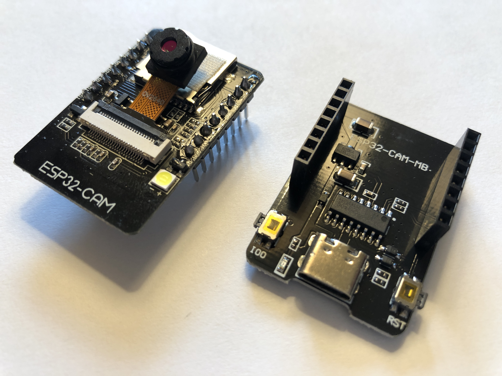
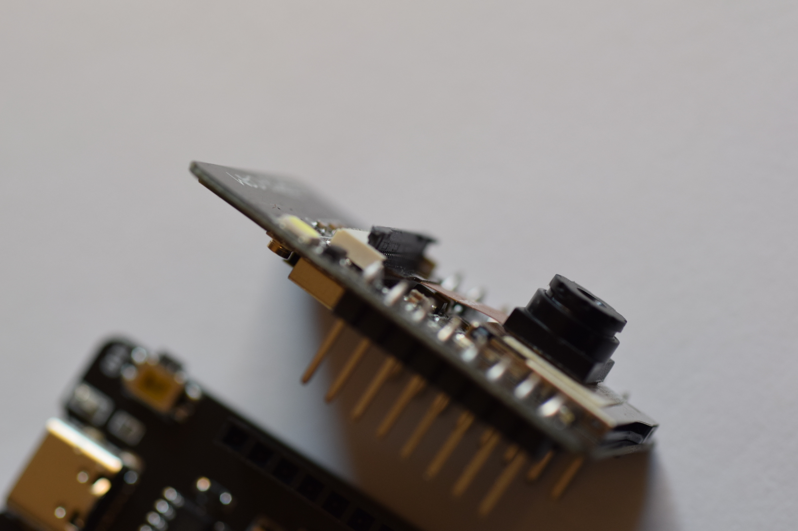
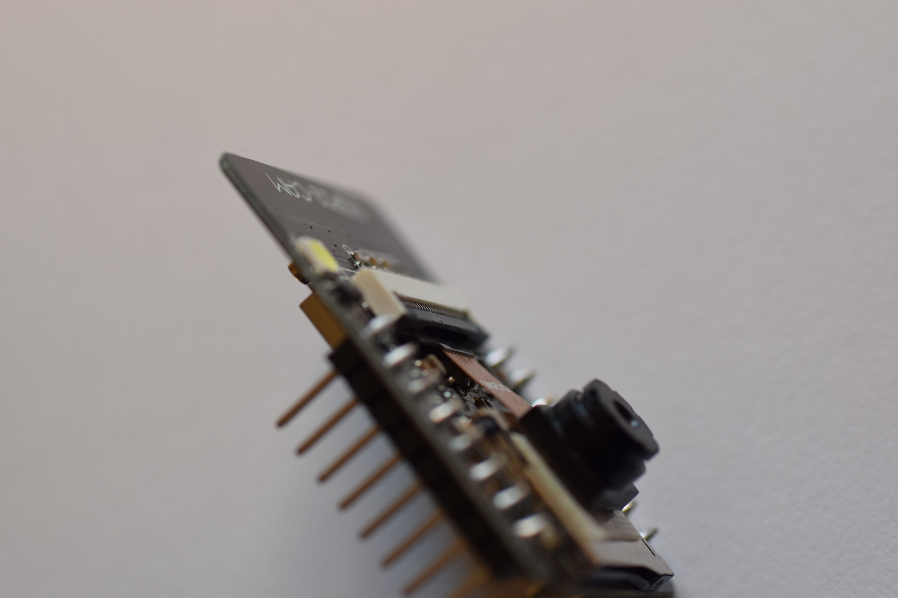

https://github.com/espressif

https://github.com/espressif/arduino-esp32


```bash
arduino-cli core -h
```

```bash
arduino-cli core --additional-urls https://raw.githubusercontent.com/espressif/arduino-esp32/gh-pages/package_esp32_index.json
```

```bash
arduino-cli core search esp32
```


```console
ID            Version Name
arduino:esp32 2.0.13  Arduino ESP32 Boards
esp32:esp32   3.0.4   esp32
```

```bash
arduino-cli core install esp32:esp32
```


```bash
arduino-cli core list
```


```console
ID          Installed Latest Name
arduino:avr 1.8.6     1.8.6  Arduino AVR Boards
esp32:esp32 3.0.4     3.0.4  esp32
```

```bash
arduino-cli board search esp32
```


```bash
arduino-cli board search esp32 | less
```


```console
Board Name                                         FQBN                                               Platform ID
4D Systems gen4-ESP32 16MB Modules (ESP32-S3R8n16) esp32:esp32:gen4-ESP32-S3R8n16                     esp32:esp32
AI Thinker ESP32-CAM                               esp32:esp32:esp32cam                               esp32:esp32
ALKS ESP32                                         esp32:esp32:alksesp32                              esp32:esp32
...
```

```bash
arduino-cli board list
```


When the esp32 is not plugged into USB:

```console
Port                            Protocol Type        Board Name FQBN Core
/dev/cu.Bluetooth-Incoming-Port serial   Serial Port Unknown
/dev/cu.wlan-debug              serial   Serial Port Unknown
```
When the esp32 **is** plugged into USB:

```console
Port                            Protocol Type              Board Name FQBN Core
/dev/cu.Bluetooth-Incoming-Port serial   Serial Port       Unknown
/dev/cu.usbserial-210           serial   Serial Port (USB) Unknown
/dev/cu.wlan-debug              serial   Serial Port       Unknown
```

```bash
arduino-cli monitor -p /dev/cu.usbserial-210 --config 115200 -b esp32:esp32:esp32cam
```

--

building /Users/twl/src/esp32-cam-min/CameraWebServer

arduino-cli compile -e --fqbn esp32:esp32:esp32cam .

arduino-cli upload -v -p /dev/cu.usbserial-210 --fqbn esp32:esp32:esp32cam .

Full command:

"/Users/twl/Library/Arduino15/packages/esp32/tools/esptool_py/4.6/esptool" --chip esp32 --port "/dev/cu.usbserial-210" --baud 460800  --before default_reset --after hard_reset write_flash  -z --flash_mode keep --flash_freq keep --flash_size keep 0x1000 "/private/var/folders/2m/m49tydvj599cf1yv8nk7f82m0000gn/T/arduino/sketches/AFE8B507A91E7CFA84208FDAFCC5A9A9/CameraWebServer.ino.bootloader.bin" 0x8000 "/private/var/folders/2m/m49tydvj599cf1yv8nk7f82m0000gn/T/arduino/sketches/AFE8B507A91E7CFA84208FDAFCC5A9A9/CameraWebServer.ino.partitions.bin" 0xe000 "/Users/twl/Library/Arduino15/packages/esp32/hardware/esp32/3.0.4/tools/partitions/boot_app0.bin" 0x10000 "/private/var/folders/2m/m49tydvj599cf1yv8nk7f82m0000gn/T/arduino/sketches/AFE8B507A91E7CFA84208FDAFCC5A9A9/CameraWebServer.ino.bin"

Changing baud rate to 460800

"/Users/twl/Library/Arduino15/packages/esp32/tools/esptool_py/4.6/esptool" 
--chip esp32 
--port "/dev/cu.usbserial-210" 
--baud 460800  
--before default_reset 
--after hard_reset write_flash  
-z 
--flash_mode keep 
--flash_freq keep 
--flash_size keep 0x1000 "/private/var/folders/2m/m49tydvj599cf1yv8nk7f82m0000gn/T/arduino/sketches/AFE8B507A91E7CFA84208FDAFCC5A9A9/CameraWebServer.ino.bootloader.bin" 
0x8000 "/private/var/folders/2m/m49tydvj599cf1yv8nk7f82m0000gn/T/arduino/sketches/AFE8B507A91E7CFA84208FDAFCC5A9A9/CameraWebServer.ino.partitions.bin" 
0xe000 "/Users/twl/Library/Arduino15/packages/esp32/hardware/esp32/3.0.4/tools/partitions/boot_app0.bin" 
0x10000 "/private/var/folders/2m/m49tydvj599cf1yv8nk7f82m0000gn/T/arduino/sketches/AFE8B507A91E7CFA84208FDAFCC5A9A9/CameraWebServer.ino.bin"


arduino-cli upload -v -p /dev/cu.usbserial-210 --fqbn esp32:esp32:esp32cam --input-dir build/esp32.esp32.esp32cam/

# leave off trailing /
arduino-cli upload -v -p /dev/cu.usbserial-210 --fqbn esp32:esp32:esp32cam --input-dir build/esp32.esp32.esp32cam

"/Users/twl/Library/Arduino15/packages/esp32/tools/esptool_py/4.6/esptool" --chip esp32 --port "/dev/cu.usbserial-210" --baud 460800  --before default_reset --after hard_reset write_flash  -z --flash_mode keep --flash_freq keep --flash_size keep 0x1000 "build/esp32.esp32.esp32cam//CameraWebServer.ino.bootloader.bin" 0x8000 "build/esp32.esp32.esp32cam//CameraWebServer.ino.partitions.bin" 0xe000 "/Users/twl/Library/Arduino15/packages/esp32/hardware/esp32/3.0.4/tools/partitions/boot_app0.bin" 0x10000 "build/esp32.esp32.esp32cam//CameraWebServer.ino.bin"

#### Device images

The ESP32-CAM MCU/camera board separated from the ESP32-CAM-MB programmer/USB:



The ESP32-CAM camera ribbon cable latch pivots, unlike Raspberry PI and camera boards where the latch slides.

Flip the latch up to open, and insert the camera's ribbon cable:



Flip down to latch and secure:




